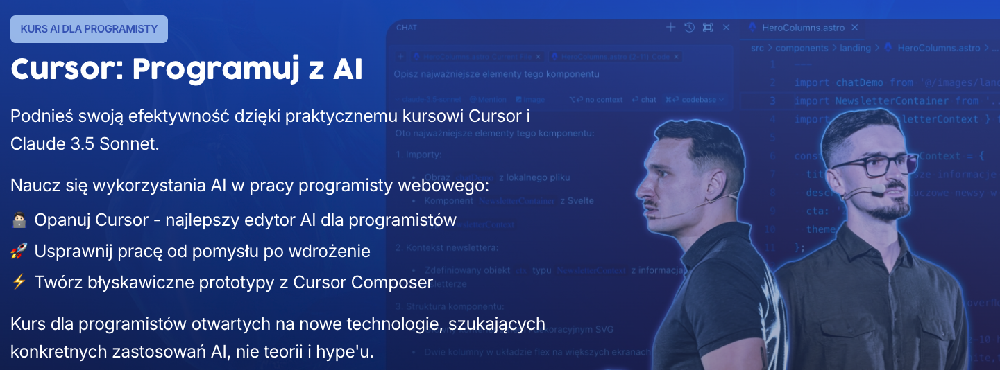

# Generatywne AI w chmurze



Kod wykorzystywany w szkoleniu [Cursor: Programuj z AI](https://opanuj.ai/kurs/cursor-programuj-z-ai/).

Przykładowe integracje z modelami Generatywnego AI w chmurach AWS, GCP, Azure oraz przez usługę OpenRouter.

## Instalacja

```bash
npm install
```

## Użycie

Wykorzystaj jeden z dostępnych skryptów z pliku `package.json`:

```bash
npm run start:aws
```

```bash
npm run start:gcp
```
